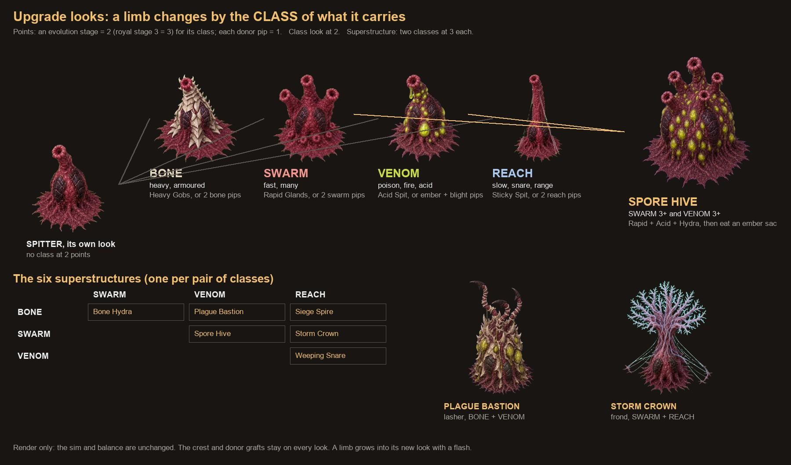

# Upgrade looks: towers change with their upgrades, by CLASS (Sep 30 2026)

Collins (Sep 30 2026): "are the towers changing with upgrades? (maybe have like a class of change so like x
with any of yps or h leads to y change and x with 2 4 5 leads to another then you get super structures for
when you have them combined with yps and 245".

**How his words were read (correct this if it is wrong).** His letters and numbers are placeholders for
GROUPS of upgrades: a limb X carrying ANY member of one group ("Y, P, S or H") changes one way; carrying any
of another group ("2, 4, 5") changes another way; carrying BOTH groups turns it into a bigger, combined
SUPERSTRUCTURE. So a limb's look follows the KIND of thing it carries, never one picture per upgrade (the
per-stage look TO-CREATE priced at ~$150, 36 limbs x 3 stages, is replaced by this). There are four groups
(classes), not two: two would have put fire and slow, or armour and range, into one look.

The rule lives in `content/upgradeLooks.ts` (render only: the sim never reads it; balance is untouched).
Tests: `tests/upgradeLooks.test.ts`.

## The four classes

| Class | What it means | How it looks (silhouette first) |
|---|---|---|
| **BONE** | heavy and armoured: harder hits, more hp, pierce, shields, thorns, swallows bigger | BROADER and spiky: thick ivory bone plates clad it, a crest of bone spikes, a wider mound |
| **SWARM** | fast and many: fires faster, more shots, more targets, arcs, splash, skips, copies | MULTIPLIED: its working part (nozzle, whip, frond) budded into three or six, round buds at its base |
| **VENOM** | caustic: poison, fire, acid and armour-shred, toxic clouds, digestion | SWOLLEN and coloured: bulging acid yellow-green glands between its plates, dripping (the one colour change, so it reads even at far zoom) |
| **REACH** | grasp and range: slows, snares, drags fliers down, knocks back, wider, farther, sees the cloaked | TALLER and wider: a longer neck or stalk, mucus or nerve guy-ropes out to the ground on both sides |

Every evolution option and every pip belongs to exactly one class (a test holds it):

- **A pip** (a verb grown by an evolution or eaten from a donor) has the class of the family it comes from (table at the end).
- **An evolution option** scores each effect it names: every verb it grows 1 point for that verb's class, every
  stat that GROWS 2 (tempo up SWARM, potency up BONE, reach up REACH; poison, burn, shred, digest VENOM;
  slow, area, grounding, air REACH; more targets, chains, copies SWARM; hp, eat, pierce BONE). Most points win; a
  tie goes to the effect named first. Two are set by hand (`CLASS_OVERRIDES`): the Lure's Strong Musk and the
  Swamp's Deep Bog are "more potent" on a limb whose verb is poison or acid, so VENOM, not BONE.

## When a limb changes

Points: an evolution stage bought counts **2** for its class (the royal stage 3 counts **3**); every pip carried
from a cannibalized donor counts **1**. (The pips an evolution grows are not counted again.)

| Look | Rule | Example |
|---|---|---|
| its own | no class at 2 points | a fresh Spitter; a Spitter with one Ember pip |
| **class look** | the strongest class at **2 or more** (one evolution in it, or two pips of it) | Rapid Glands: SWARM. Donor pips of an Ember Sac and a Blight Vent: VENOM |
| **superstructure** | **two** classes at **3 or more** each | Rapid Glands + Acid Spit + Hydra Throat (SWARM 5, VENOM 2) is still SWARM; eat one Ember Sac into it (VENOM 3): **Spore Hive** |

- A tie goes to the class of what was chosen last (an evolution outranks a pip): the change just made is the one seen.
- The superstructure rewards the game's core, the combo runaway: an evolution path alone gives a class look; a
  superstructure takes evolutions AND donors eaten into it (or many donors of two kinds).
- When a limb's superstructure is not drawn yet, it shows the stronger of its two classes; when that is not drawn, its own look.
- Donor-part grafts stay on every look (placed from each variant's own graft points, measured at its bake).
- The crest (a spike or diamond per stage) stays: it says WHICH evolutions; the look says what KIND of limb it became.

## The superstructures (one per pair of classes)

|  | SWARM | VENOM | REACH |
|---|---|---|---|
| **BONE** | **Bone Hydra**: an armoured mass of many heads, every copy clad in bone and crowned with spikes | **Plague Bastion**: a massive armoured bastion, glowing venom glands bulging between its bone plates | **Siege Spire**: a tall armoured spire on a bone column, anchored by tendon guy-ropes |
| **SWARM** |  | **Spore Hive**: a towering hive of many mouths on a body studded with dripping venom glands | **Storm Crown**: a tall crown of many branching tips on a raised stalk, strands reaching out to the sides |
| **VENOM** |  |  | **Weeping Snare**: a tall dripping canopy, venom weeping down mucus strands spread wide |

A superstructure is drawn half again as tall and much bigger than the limb: at game zoom it is the tallest thing on its block.

## How it reads at game zoom

Silhouette first, colour second: BONE is broad, spiky and pale; SWARM has several heads; VENOM is swollen and
the only yellow-green; REACH is tall with lines to the ground; a superstructure is bigger than everything near
it. Seen in the game at normal zoom and close: `notes/screens/2026-09-30/upgrade-looks-*.jpg`.

When a limb earns a new look it GROWS into it: it dips, swells past its size and settles (0.75 s) under a warm
flash (`src/render/isoRender.ts`, LOOK_GROW). `?looks=off` draws every limb in its own look (for comparisons).

## The prototype: three limbs

**Spitter, Lasher, Galvanic Frond**, because between them they meet every case the rollout will: the Spitter is
the most built limb, small (one cell), fires from a marked muzzle and has a view from behind (so its variants
need backs); the Lasher is melee (no muzzle), tall and thin, with no view from behind (it is mirrored); the
Frond is BIG (four cells, 384 px frames), a quiet limb (the game draws its arcs) with four muzzles.

| Limb | BONE | SWARM | VENOM | REACH | Superstructure |
|---|---|---|---|---|---|
| Spitter | bone cuirass, spike crest | three nozzles | glands, a hanging drop | long neck, mucus guy-ropes | **Spore Hive** (SWARM+VENOM): five nozzles on a gland-studded hive |
| Lasher | bone-banded whips, bone plates | six whips | glands, venom sacs at the tips | whips twice as long, a web between | **Plague Bastion** (BONE+VENOM) |
| Frond | bone-clad mound, spikes | three fronds | glands, venom beads | raised on a tall stalk, nerve guy-ropes | **Storm Crown** (SWARM+REACH) |

How each was made (`tools/art/limb-variants.mjs`, `tools/art/templates/limb-variant.mjs`,
`node tools/art/make.mjs variant <family>`): an image edit of the limb's own approved picture
(`art-src/limbs/<family>/styled.png`: same camera, same place and size of its skirt, same direction); VENOM
looks on blue (their yellow-green would be eaten by a green key), the rest on green; the limb's own idle and
firing prompts (the counts changed where it multiplies); the Spitter's views from behind drawn from each
variant's picture; keyed, cut (ping-pong where no clean loop) and baked exactly as the limb is; the foot and
muzzle of every variant marked by eye (`node tools/art/feet.mjs --variants`, `node tools/art/muzzles.mjs
--variants`). Raw files: `art-src/limbs/<family>-variants/<key>/`. Baked: `public/art/limbs/<family>--<key>.webp`,
manifest `limbs.<family>.variants.<key>` (baking the limb again keeps its variants). A variant has no death
clip of its own: it withers with the game's slump.

COST_SECTION

## Tables: every option and pip, classed

| Limb | Stage 1: A / B | Stage 2: A / B | Stage 3 (royal): A / B |
|---|---|---|---|
| spitter | Rapid Glands **SWARM** / Heavy Gobs **BONE** | Acid Spit **VENOM** / Sticky Spit **REACH** | Hydra Throat **SWARM** / Long Throat **REACH** |
| burster | Wide Burst **REACH** / Dense Burst **BONE** | Shrapnel **BONE** / Napalm Polyps **VENOM** | Cluster Polyps **SWARM** / Skyburst **REACH** |
| lasher | Long Whips **REACH** / Barbed Whips **BONE** | Rending **VENOM** / Thrashing **SWARM** | Hydra Lashes **SWARM** / Gorger **BONE** |
| maw | Bigger Gullet **BONE** / Faster Jaws **SWARM** | Rich Digestion **BONE** / Acid Stomach **VENOM** | Swallow Whole **BONE** / Regurgitate **SWARM** |
| spine | Thick Hide **BONE** / Barbs **BONE** | Caltrop Shedding **BONE** / Toxic Barbs **VENOM** | Bone Fortress **BONE** / Living Wall **BONE** |
| lure | Strong Musk **VENOM** / Quick Pulse **SWARM** | Wide Cloud **REACH** / Tar Musk **REACH** | Queen's Scent **VENOM** / Firedamp **VENOM** |
| tangler | Thick Mucus **REACH** / Wide Bed **REACH** | Caustic Mucus **VENOM** / Grasping **REACH** | Tar Pit **REACH** / Digestive Mucus **VENOM** |
| blighter | Virulent **VENOM** / Lingering **VENOM** | Airborne Spores **REACH** / Rot **VENOM** | Plague **SWARM** / Necrosis **VENOM** |
| impaler | Heavy Harpoon **BONE** / Quick Reload **SWARM** | Barbed Harpoon **REACH** / Serrated **VENOM** | Railspine **REACH** / Harpoon Volley **SWARM** |
| choir | Loud Choir **BONE** / Wide Choir **REACH** | Chorus of Thorns **BONE** / Chorus of Venom **VENOM** | Cathedral **BONE** / Choir of Chains **SWARM** |
| sling | Long Arm **REACH** / Quick Arm **SWARM** | Big Clots **REACH** / Seeding **REACH** | Barrage **SWARM** / Bone Clots **BONE** |
| brood | Big Brood **SWARM** / Quick Brood **SWARM** | Armoured Brood **BONE** / Venom Brood **VENOM** | Swarm Queen **SWARM** / War Brood **BONE** |
| swamp | Deep Bog **VENOM** / Wide Bog **REACH** | Gastric Acid **VENOM** / Quicksand **REACH** | Great Gut **VENOM** / Tar Fire **VENOM** |
| frond | Long Arc **SWARM** / Hot Arc **BONE** | Stun Arc **REACH** / Searing Arc **VENOM** | Storm Frond **SWARM** / Grounding Rod **REACH** |
| lobber | Big Glob **REACH** / Quick Glob **SWARM** | Sticky Bile **REACH** / Burning Bile **VENOM** | Triple Glob **SWARM** / Acid Rain **BONE** |
| mister | Deep Shred **VENOM** / Long Cling **VENOM** | Tracer Mist **REACH** / Choking Mist **VENOM** | Dissolving Mist **VENOM** / Weeping Mist **VENOM** |
| ocular | Quick Focus **SWARM** / Heavy Stare **BONE** | Execution Stare **VENOM** / Marking Stare **VENOM** | Twin Stalk **SWARM** / Death Glare **BONE** |
| prism | Focus Lens **SWARM** / Wide Lens **REACH** | Scorch **VENOM** / Refract **SWARM** | Overcharge **BONE** / Grid Prism **REACH** |
| bombard | Bigger Shell **REACH** / Faster Shell **SWARM** | Spore Shell **VENOM** / Incendiary **VENOM** | Double Barrage **SWARM** / Earthshaker **REACH** |
| ward | Thick Membrane **BONE** / Wide Membrane **REACH** | Quick Mend **SWARM** / Barbed Membrane **BONE** | Aegis **BONE** / Grasping Membrane **REACH** |
| quill | Tight Choke **BONE** / Long Fan **REACH** | Barbed Quills **REACH** / Venom Quills **VENOM** | Porcupine **SWARM** / Bone Needles **BONE** |
| skipper | Extra Skip **SWARM** / Heavy Shell **BONE** | Burning Wake **VENOM** / Sticky Wake **REACH** | Endless Skip **SWARM** / Twin Mortar **SWARM** |
| net | Heavy Net **REACH** / Fast Net **SWARM** | Barbed Net **BONE** / Ground Web **REACH** | Storm Net **SWARM** / Flak Burst **BONE** |
| ember | Hot Oil **VENOM** / Long Flame **REACH** | Sticky Oil **REACH** / Toxic Smoke **VENOM** | Inferno **VENOM** / Wildfire **SWARM** |
| lance | Long Runner **REACH** / Broad Runner **REACH** | Quick Runner **SWARM** / Deep Runner **BONE** | Great Runner **REACH** / Delta **REACH** |
| cage | Wide Jaws **REACH** / Early Snap **BONE** | Iron Bars **BONE** / Twin Cage **BONE** | Puppet Master **BONE** / Hive Mind **SWARM** |
| sprout | Hardy Shoot **BONE** / Quick Shoot **SWARM** | Long Stem **REACH** / Sharp Seed **BONE** | Grown Up **BONE** / Seed Burst **SWARM** |
| conduit | Wide Gather **REACH** / Long Lane **REACH** | Deep Channel **SWARM** / Blood Rush **SWARM** | Great Conduit **SWARM** / Marrow Pump **SWARM** |
| amp | Long Reach **REACH** / Tuned **SWARM** | Overtone **SWARM** / Round Up **SWARM** | Second Voice **SWARM** / Ascendant **SWARM** |
| mosaic | Wide Gather **REACH** / Long Lane **REACH** | Double Tiles **SWARM** / Self Tile **SWARM** | Triple Tiles **SWARM** / Grand Mosaic **REACH** |
| twin | Long Reach **REACH** / Spray **SWARM** | Triplet **SWARM** / Split Shot **SWARM** | Quad **SWARM** / Echo Volley **SWARM** |
| tap | Long Tap **REACH** / Gentle Tap **BONE** | Deep Tap **SWARM** / Siphon **BONE** | Wellspring **SWARM** / Gentle Well **BONE** |
| mitosis | Fertile **SWARM** / Wide Womb **REACH** | Grafted Buds **SWARM** / Hardy Buds **SWARM** | True Copy **SWARM** / Swarm Womb **SWARM** |
| capacitor | Fast Charge **SWARM** / Overclock **SWARM** | Trickle **SWARM** / Static **SWARM** | Supercap **SWARM** / Thunderbank **SWARM** |
| boomerang | Far Call **REACH** / Heavy Return **BONE** | Ricochet **SWARM** / Sticky Return **REACH** | Orbit **SWARM** / Razor Return **BONE** |
| press | Long Press **REACH** / Rich Press **BONE** | Richer Press **BONE** / Hungry Press **BONE** | Golden Press **BONE** / Royal Press **BONE** |
| reliquary | Long Vigil **REACH** / Double Relic **SWARM** | Resurrection **BONE** / Triple Relic **SWARM** | Phoenix **BONE** / Martyr's Hoard **SWARM** |

| Class | Pips of these families |
|---|---|
| BONE | lasher, spine, impaler, ward, brood, maw, reliquary, press, tap |
| SWARM | spitter, burster, quill, twin, frond, prism, skipper, mitosis, capacitor, boomerang, sprout, amp, mosaic, conduit |
| VENOM | blighter, ember, mister, lure, swamp |
| REACH | tangler, net, ocular, lobber, bombard, choir, sling, lance, cage |
